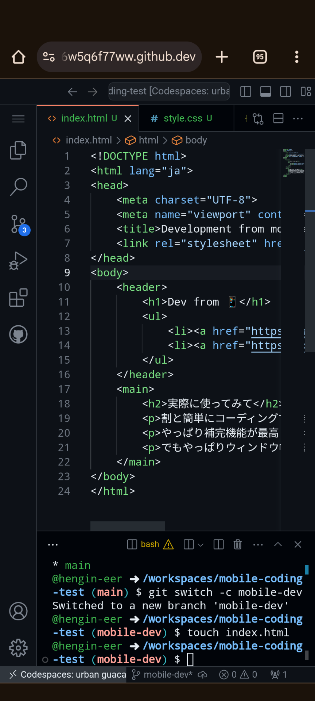
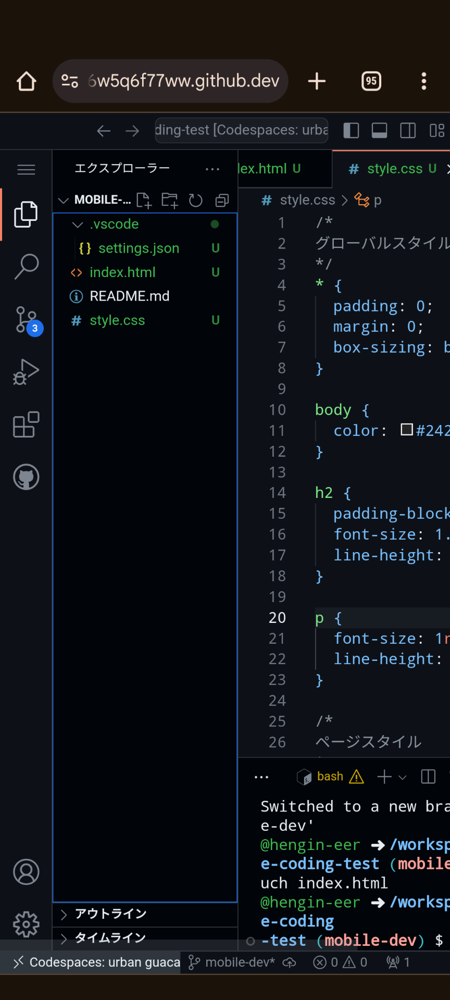
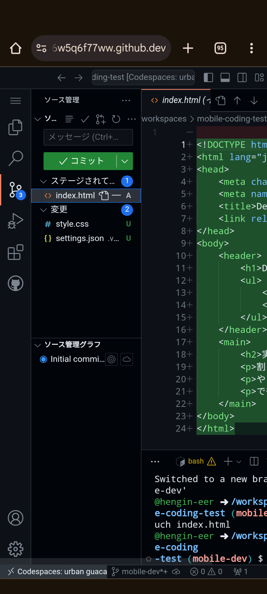
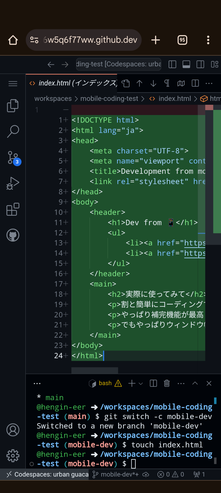

# mobile-coding-test

GitHub Codespaces を使ってモバイル環境で開発してみる試み

## 開発の様子

モバイル（での）開発の様子をスクリーンショットともにお送りします。

### エディターの外観

エディターの外観は次のような感じ。

サイドバーを展開すると以下のような感じ。

### コミットもできます

codespace を開いたタイミングで、node 環境や git 環境など、メジャーな開発環境を整えてくれます！
なので、コミットも codespace からできます。

サイドバーのソース管理を開いた様子。

diff もギリギリ確認できます（辛い）。

